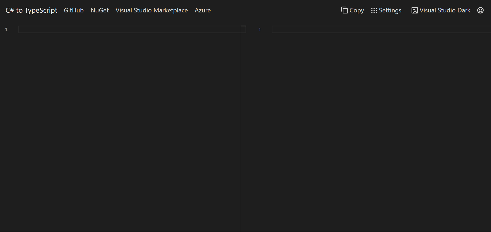

# C# to TypeScript

Convert C# Models, ViewModels and DTOs into their TypeScript equivalents using webapp, .NET Core CLI Tool or VSCode extension.

## Learn more

**Visual Studio Code Extension**: https://github.com/AdrianWilczynski/CSharpToTypeScript/blob/master/src/CSharpToTypeScript.VSCodeExtension/README.md

**Command Line Interface**: https://github.com/AdrianWilczynski/CSharpToTypeScript/blob/master/src/CSharpToTypeScript.CLITool/README.md