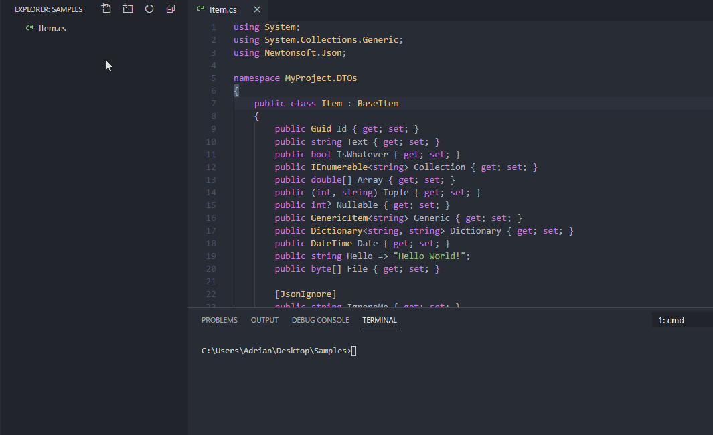
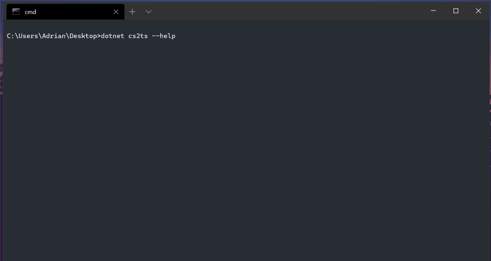
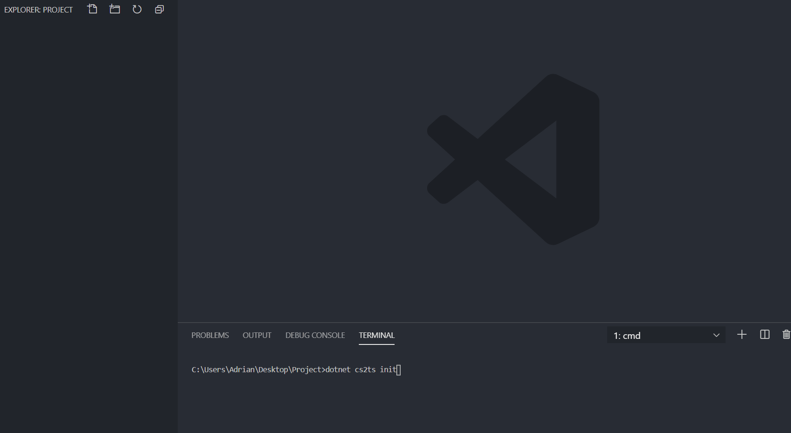

# C# to TypeScript

Convert C# Models, ViewModels and DTOs into their TypeScript equivalents.





## Installing

```cmd
dotnet tool install --global CSharpToTypeScript.CLITool
```

## Usage

```cmd
dotnet cs2ts [options] <Input>
```

| Arguments:                                         |                                                           |
|----------------------------------------------------|-----------------------------------------------------------|
| Input                                              | Input file or directory path                              |

| Options:                                           |                                                           |
|----------------------------------------------------|-----------------------------------------------------------|
| -o\|--output \<OUTPUT\>                            | Output file or directory path                             |
| -t\|--use-tabs                                     | Use tabs for indentation                                  |
| -ts\|--tab-size \<TAB_SIZE\>                       | Number of spaces per tab                                  |
| -se\|--skip-export                                 | Skip 'export' keyword                                     |
| -k\|--use-kebab-case                               | Use kebab case for output file names                      |
| -m\|--append-model-suffix                          | Append '.model' suffix to output file names               |
| -c\|--clear-output-directory                       | Clear output directory                                    |
| -a\|--angular-mode                                 | Use Angular style conventions                             |
| -p\|--partial-override                             | Override only part of output file between marker comments |
| -pc\|--preserve-casing                             | Don't convert field names to camel case                   |
| -pip\|--preserve-interface-prefix                  | Don't remove interface prefixes                           |
| -d\|--convert-dates-to \<String\|Date\|Union\>     | Set output type for dates                                 |
| -n\|--convert-nullables-to \<Null\|Undefined\>     | Set output type for nullables                             |
| -i\|--import-generation \<None\|Simple\>           | Enable import generation\*                                |
| -q\|--quotation-mark \<Double\|Single\>            | Set quotation marks for import statements & identifers    |
| -?\|-h\|--help                                     | Show help information                                     |

\* Simple import generation assumes flat output directory structure and file names corresponding to type names (e.g. `MyType`: `myType.ts`, `my-type.ts`, `my-type.model.ts`).

## Configuration file



To create optional configuration file (`cs2tsconfig.json`) in current directory run:

```cmd
dotnet cs2ts init
```

### Content

```json
{
  "$schema": "https://adrianwilczynski.github.io/CSharpToTypeScript/cs2tsconfig.json",
  "input": ".",
  "output": null,
  "useTabs": false,
  "tabSize": 4,
  "skipExport": false,
  "useKebabCase": false,
  "appendModelSuffix": false,
  "clearOutputDirectory": false,
  "angularMode": false,
  "partialOverride": false,
  "preserveCasing": false,
  "preserveInterfacePrefix": false,
  "convertDatesTo": "string",
  "convertNullablesTo": "null",
  "importGeneration": "none",
  "quotationMark": "double"
}
```

## Run on Build

**Sample**: https://github.com/AdrianWilczynski/CSharpToTypeScript/tree/master/samples/RunOnBuild

Add `Exec` task to `.csproj` file.

```xml
<Target Name="CSharpToTypeScript" BeforeTargets="Build">
    <Exec Command="dotnet cs2ts ./DTOs -o ./Client/models -i Simple -q Single -c" />
</Target>
```

## Watch with `dotnet watch`

Run:

```cmd
dotnet watch cs2ts ./DTOs -o ./wwwroot/ts/models
```